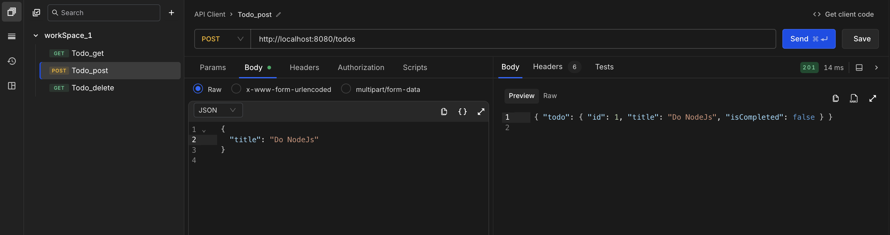
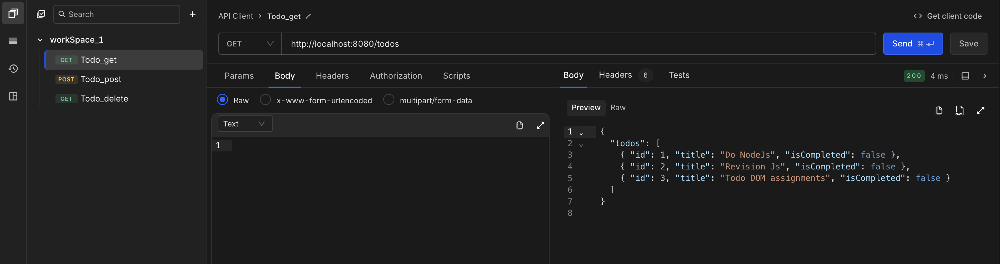
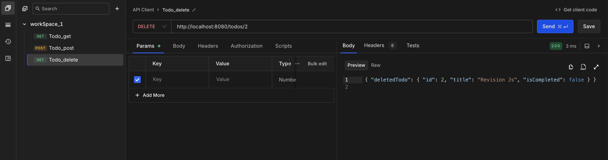
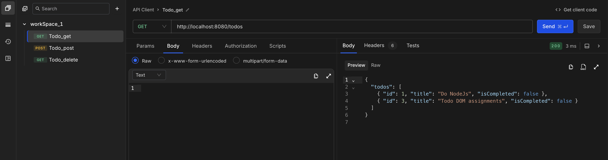

## A simple Todo API built using Express.js and TypeScript.

This project demonstrates how to structure a basic backend service with type safety and validation.

- Setting up Express with TypeScript
- Basic project structure (routes, controllers, validation)
- Simple API routes
- Type-safe backend development
- Request validation using Zod

## Running the Server

Install dependencies and start the server:

```bash
npm install
npm run dev
```

Server will run at:

```
http://localhost:8080
```

---

## Testing the API

To test the API, use any API client such as **Postman** or **Requestly**.

---

## API Endpoints

```
GET     /todos        → Get all todos
POST    /todos        → Create a todo
DELETE  /todos/:id    → Delete a todo
```

---

## Example Screenshots

InsertTodo: /post


GetTodo: /get


deleteTodo: /delete/<todoID>


after todo is deleted:


## Tech Stack

- Node.js
- Express.js
- TypeScript
- Zod

---

Created as a learning project to understand **Express + TypeScript backend development**.
